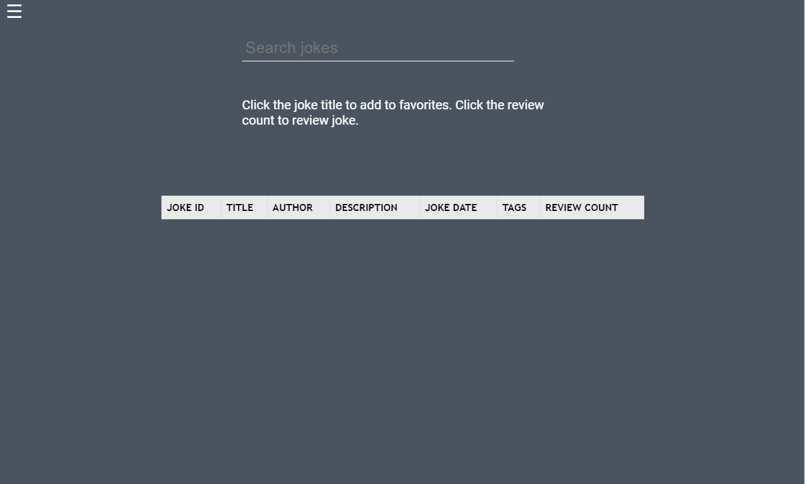
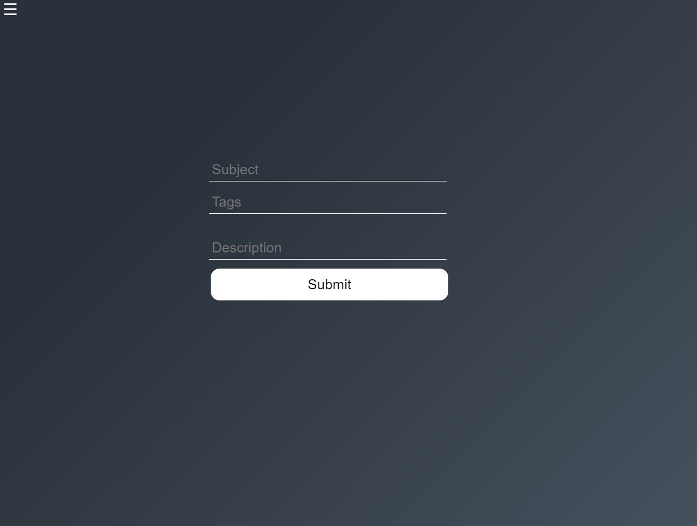

# Jokes-Website
A fully functional joke website that allows you to view, rate, review, and create jokes on a dynamic page. Created using JSP, Java, MySQL, and HTML/CSS. 

Once logged in, you are greeted by the welcome home. From there you can do multiple actions like search for jokes, friends, or even add your own jokes.

